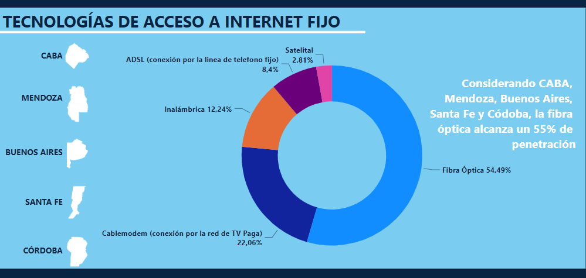
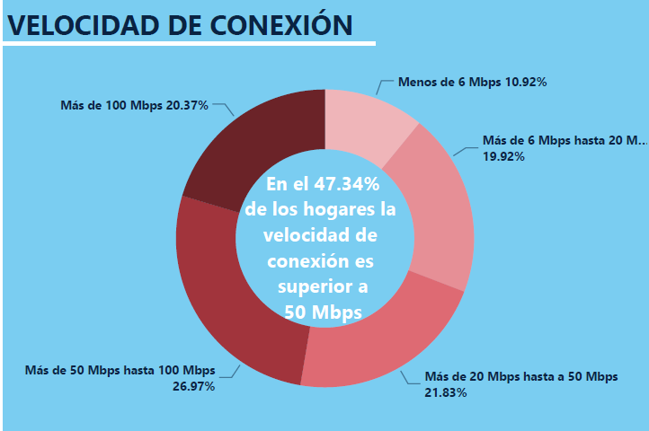

# Análisis de Conexión a Internet en la República Argentina 

 

(https://www.cabase.org.ar/el-47porciento-de-las-conexiones-a-internet-en-hogares-argentinos-supera-los-50-mbps/)

## Resumen del Proyecto

El proyecto tiene como objetivo realizar un análisis exhaustivo de la conexión a Internet fija en la República Argentina utilizando datos proporcionados por fuentes oficiales como Enacom. Se ha llevado a cabo un proceso completo que incluye la ETL (Extracción, Transformación y Carga), el EDA (Análisis Exploratorio de Datos), el planteo de KPIs (Indicadores Clave de Rendimiento) y la visualización de datos en un dashboard interactivo utilizando Power BI.

## Objetivos del Proyecto

1. **ETL y EDA**: Procesar y analizar los datos de acceso a Internet para identificar patrones, tendencias y áreas de mejora.
2. **KPI 1**: Aumentar en un 2% el acceso al servicio de Internet para el próximo trimestre, cada 100 hogares, por provincia.
3. **KPI 2**:  Obtener un promedio de conexiones por cada 100 hogares igual o superior al 65%, por provincia.
4. **KPI 3**: Evaluar la distribución equitativa del acceso a Internet utilizando el Coeficiente de Variación (CV) y asegurarse de que la variabilidad entre provincias se mantenga por debajo del 15%.
5. **Dashboard**: Crear un dashboard en Power BI para visualizar los datos de manera interactiva y proporcionar una visión clara del desempeño y las tendencias en la conectividad a Internet. 

## Análisis de KPIs

### KPI 1: Aumento del Acceso a Internet

**Resumen**:  
**Aumentar en un 2% el acceso al servicio de Internet por cada 100 hogares para el próximo trimestre** en cada provincia es el objetivo. El seguimiento de este KPI permitirá evaluar la efectividad de las estrategias implementadas para mejorar la conectividad.

**Resultados**:
- **Número total de provincias**: 24
- **Número de provincias que cumplieron el objetivo en el utlimo trimestre**: 5
- **Número de provincias que no cumplieron el objetivo**: 19

**Recomendaciones**:
1. **Investigación de Causas**: Identificar las razones detrás del incumplimiento del objetivo en provincias específicas.
2. **Desarrollo de Estrategias**: Implementar estrategias para aumentar la conectividad en las provincias que no cumplieron el objetivo.
3. **Monitoreo Continuo**: Establecer un sistema para medir el progreso hacia el objetivo del 2% y ajustar las estrategias según sea necesario, con la posibilidad de imitar aquellas provincias que si lo han logrado. 

### KPI 2: Porcentaje de con Conexión ≥ 65%, por Provincia

**Resumen**:  
En el último análisis, **19 de las 24 provincias no alcanzaron el objetivo del 65% de conexiones por cada 100 hogares**. Este bajo desempeño sugiere que varias provincias todavía enfrentan desafíos significativos para mejorar su conectividad.

**Recomendaciones**:
1. **Investigación de Causas**: Realizar un análisis detallado para identificar las causas subyacentes del bajo desempeño.
2. **Implementación de Soluciones Localizadas**: Crear soluciones tecnológicas y programas de infraestructura adaptados a las necesidades específicas de las provincias rezagadas.
3. **Planes de Acción Regionales**: Desarrollar e implementar planes de acción específicos para cada provincia basada en las barreras identificadas.

### KPI 3: Coeficiente de Variación (CV)

**Resumen**:  
El **Coeficiente de Variación (CV) para el acceso a Internet por cada 100 hogares se mantiene por debajo del 15% en todas las provincias en los últimos dos años**. Esto indica una distribución equitativa de la conectividad, con baja variabilidad entre provincias.

**Recomendaciones**:
1. **Monitoreo Continuo**: Continuar el seguimiento del CV para mantener la equidad en el acceso a Internet.
2. **Evaluación de Objetivos**: Considerar ajustar el objetivo para buscar una mayor equidad o mejorar otros aspectos relacionados con la conectividad.
3. **Investigación de Mejores Prácticas**: Estudiar y aplicar políticas exitosas en provincias que han logrado una distribución equitativa.

## Proceso y Herramientas Utilizadas

1. **ETL y EDA**:
   - **Librerías de Python**: pandas, matplotlib, seaborn.
   - **Herramientas**: Visual Studio Code, Data Wrangler.

2. **Visualización y Dashboard**:
   - **Herramienta**: Power BI.
   - **Elementos**: Graficos de cascada, gráficos de barras, medidores de progreso,etc 

## Conclusión del análisis.

Aunque la tendencia general es positiva y muchas provincias están avanzando en la mejora de la conectividad, es crucial abordar los desafíos persistentes en las provincias que no han alcanzado los objetivos establecidos. A través de un enfoque dirigido y estrategias adaptadas, se puede trabajar para asegurar que todas las provincias cumplan con los objetivos de conectividad y se mantenga la equidad en la distribución de los servicios de Internet.

### Evolución de la Tecnología y Velocidad de Conexión

A lo largo del tiempo, se ha observado una disminución significativa en el uso de la tecnología ADSL, mientras que otras tecnologías más avanzadas como cable modem, fibra óptica y conexiones inalámbricas (wireless) han experimentado un notable incremento. Este cambio refleja la adopción de tecnologías más modernas y eficientes, que ofrecen mejor rendimiento y velocidad a los usuarios.

- **ADSL**: La tecnología ADSL, que solía ser predominante, ha visto una reducción considerable en su uso debido a sus limitaciones en velocidad y capacidad comparadas con las tecnologías más nuevas.
- **Cable Modem**: Ha habido un aumento constante en la adopción de cable modem, que ofrece velocidades más altas y mayor estabilidad.
- **Fibra Óptica**: La fibra óptica ha mostrado el crecimiento más significativo, proporcionando velocidades de conexión superiores y mayor confiabilidad, lo que la convierte en la tecnología preferida en muchas áreas.
- **Conexiones Inalámbricas (Wireless)**: Las conexiones inalámbricas también han crecido, especialmente en áreas donde la instalación de infraestructura física es más desafiante.

### Mejora en la Velocidad de Conexión

La velocidad promedio de bajada ha ido aumentando con el correr del tiempo. Este incremento es un indicador positivo de la mejora en la infraestructura de red y la adopción de tecnologías más avanzadas por parte de los proveedores de servicios de Internet.

- **Velocidad Promedio de Bajada**: La velocidad promedio de bajada ha incrementado significativamente, proporcionando a los usuarios una experiencia de navegación más rápida y eficiente. Este incremento en velocidad es crucial para soportar aplicaciones y servicios que requieren mayor ancho de banda, como el streaming de video, videollamadas y juegos en línea.

## Oportunidades de Crecimiento para la Empresa

### Expansión de la Infraestructura de Fibra Óptica
La fibra óptica ha mostrado un crecimiento significativo debido a sus altas velocidades y fiabilidad. Invertir en la expansión de la infraestructura de fibra óptica, especialmente en provincias que aún dependen de ADSL, puede abrir nuevos mercados y aumentar la base de clientes.

### Desarrollo de Soluciones de Conectividad Inalámbrica
Las conexiones inalámbricas están creciendo, especialmente en áreas rurales y remotas. Ofrecer soluciones de conectividad inalámbrica puede proporcionar acceso a Internet en regiones donde la fibra óptica y el cable modem no son viables, expandiendo el alcance de la empresa.

### Paquetes de Servicios de Alta Velocidad
Con el aumento de la velocidad promedio de bajada, hay una oportunidad para comercializar paquetes de servicios de alta velocidad para hogares y empresas que necesitan mayor ancho de banda. Esto incluye servicios como streaming de video en alta definición, videollamadas y juegos en línea.

### Soluciones Personalizadas para Empresas
Ofrecer soluciones de conectividad personalizadas para negocios que requieren conexiones robustas y confiables puede atraer a clientes empresariales que necesitan velocidades garantizadas y soporte técnico dedicado.

### Conclusión
Aprovechando la tendencia hacia tecnologías más avanzadas y la necesidad de mejorar la conectividad en provincias rezagadas, la empresa puede expandir su mercado, mejorar la calidad del servicio y aumentar su base de clientes. Con una estrategia enfocada en la innovación y el desarrollo de infraestructura, es posible capitalizar estas oportunidades y contribuir al crecimiento del sector de telecomunicaciones en el país.

### Fuentes adicionales. 
https://www.cabase.org.ar/el-47porciento-de-las-conexiones-a-internet-en-hogares-argentinos-supera-los-50-mbps/

https://www.argentina.gob.ar/noticias/desde-2015-se-invirtieron-4000-millones-para-llevar-internet-mas-argentinos

https://www.argentina.gob.ar/sites/default/files/2023/03/el_estado_nacional_y_la_universalizacion_del_acceso_a_internet.pdf

## Agradecimientos

Quiero expresar mi más sincero agradecimiento a mis compañeros, profesores, TA y HA por su constante apoyo y por enriquecer mi aprendizaje con sus conocimientos y experiencia. Su dedicación y colaboración han sido fundamentales en el desarrollo de este proyecto.
